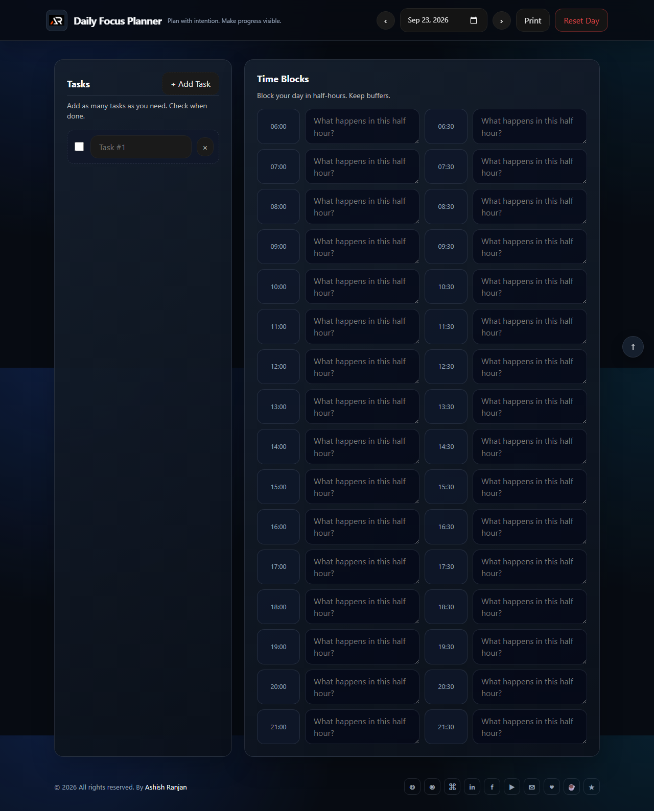

# Daily Focus Planner

A focused static planner for managing daily tasks and half-hour time blocks. Data is saved in the browser by date, so the app works without a backend.



## Features

- Date-based tasks with local storage autosave
- Checkable and removable tasks
- Half-hour planning blocks from morning to evening
- Previous and next day navigation with a date picker
- Print-ready layout, responsive header, and go-to-top control

## Tech stack

HTML, CSS, SCSS, and JavaScript.

## Run locally

Open `index.html` in a browser or use any local static server.

```bash
npm install
npm run deploy
```

## Links

- Portfolio: [https://www.ashishranjan.net](https://www.ashishranjan.net)
- GitHub: [https://github.com/a2rp](https://github.com/a2rp)
- CodePen: [https://codepen.io/ash1198](https://codepen.io/ash1198)
- LinkedIn: [https://www.linkedin.com/in/aashishranjan](https://www.linkedin.com/in/aashishranjan)
- Facebook: [https://www.facebook.com/theash.ashish/](https://www.facebook.com/theash.ashish/)
- YouTube: [https://www.youtube.com/@ashishranjan-ashz?sub_confirmation=1](https://www.youtube.com/@ashishranjan-ashz?sub_confirmation=1)
- Email: [ash.ranjan09@gmail.com](mailto:ash.ranjan09@gmail.com)

## Support

- Support: [https://a2rp-donation-page.netlify.app/](https://a2rp-donation-page.netlify.app/)
- Buy Me a Coffee: [https://buymeacoffee.com/a2rp](https://buymeacoffee.com/a2rp)
- Patreon: [https://patreon.com/a2rp](https://patreon.com/a2rp)
